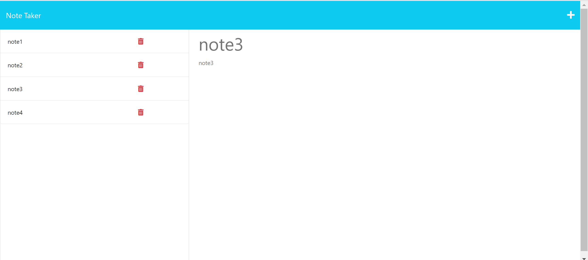

    # Note Taker!
Note taker! Built using HTML, CSS, Javascript, NodeJs and Express.

## Description

This project is a note taker. Users write a note title and text, and can save their note which then appears in a list on the left side of the webpage. All created notes are displayed.

This project served as an opportunity to practice the implementation of HTTP methods in NodeJs and Express 

## Installation

The project can be accessed at: https://note-taker-serverside.herokuapp.com/notes

## Usage

Click on the + button in the top right corner of the webpage to start a new note. Type text in the title and text sections for the save icon to appear on the right side of the navbar. Click the save button to save your note.

Click the delete button to delete your note.

## Bugs
The delete route (and therefore delete functionality) only works properly when the server is booted up with the database file preloaded with data. 
If this is the case, you can delete select items one by one.
If, however, you make post requests and THEN try delete something, it will just delete multiple things (or everything) inside the database file.

## License

MIT License

Copyright (c) [2022] [NikolasTernezis]

Permission is hereby granted, free of charge, to any person obtaining a copy
of this software and associated documentation files (the "Software"), to deal
in the Software without restriction, including without limitation the rights
to use, copy, modify, merge, publish, distribute, sublicense, and/or sell
copies of the Software, and to permit persons to whom the Software is
furnished to do so, subject to the following conditions:

The above copyright notice and this permission notice shall be included in all
copies or substantial portions of the Software.

THE SOFTWARE IS PROVIDED "AS IS", WITHOUT WARRANTY OF ANY KIND, EXPRESS OR
IMPLIED, INCLUDING BUT NOT LIMITED TO THE WARRANTIES OF MERCHANTABILITY,
FITNESS FOR A PARTICULAR PURPOSE AND NONINFRINGEMENT. IN NO EVENT SHALL THE
AUTHORS OR COPYRIGHT HOLDERS BE LIABLE FOR ANY CLAIM, DAMAGES OR OTHER
LIABILITY, WHETHER IN AN ACTION OF CONTRACT, TORT OR OTHERWISE, ARISING FROM,
OUT OF OR IN CONNECTION WITH THE SOFTWARE OR THE USE OR OTHER DEALINGS IN THE
SOFTWARE.